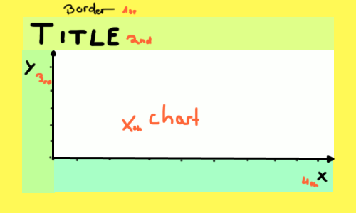
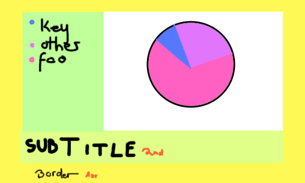
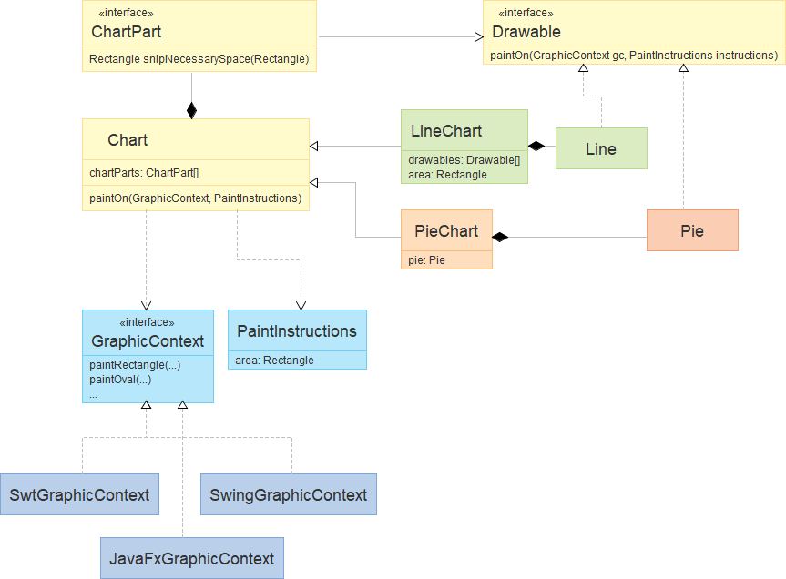

# Preliminary Considerations

To create something great, you need to plan ahead even before starting. Even more so if the project will span over a lot of time.

This project, when finished, is supposed to display electropherograms. I'm entirely sure that's just a regular chart with some stuff extra. So that's where we're starting.

A chart is basically some flavor stuff surrounding an area where the actual chart is. So for a line chart it looks like this:

 
 
 For a pie chart:
 
 
 
So the "flavor stuff" like borders and titles is stuff shared by all (or at least some) kind of charts. Let's call them `ChartPart`. The white part is where the charts differ.

For line charts, which are the first kind of charts I want (since I want an electropherogram), we can paint lines and other graphs and even circles and rectangles and it will still kinda make sense. So the `LineChart` will get an array of abstract objects that can be drawn on a canvas, the `Drawable`s.

`Drawable`s and `Chart`s can be drawn to an abstract canvas, the `GraphicContext`, which will be implemented by different frameworks.

All in all, the basic class setup looks something like this:

 
